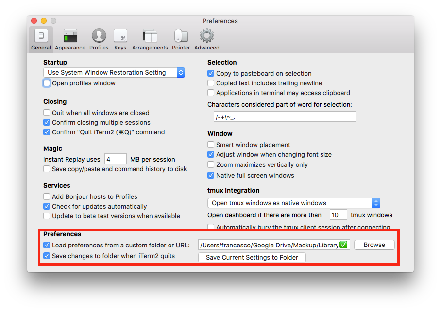

# iTerm2
[https://iterm2.com/][1]

## Sincronizzazione impostazioni

**Attenzione! Nota di dicembre 2020**
La possibilità di impostare la cartella di configurazione non c'è più, quindi forse non è più necessario
Ho visto che alcune configurazioni venivano aggiornate tra mac personale e lavoro, ma non posso essere certo che sia giusto perché magari l'impostazione della cartella di configurazione è ancora scritta da qualche parte e iTerm va ancora a leggerla, anche se io non posso più cambiarla.
Dovrei provare con un'installazione da zero

----

iTerm non è semplice da sincronizzare con Mackup perché ogni volta che viene avviato sovrascrive il file simbolico in `~/Library/Preferences`.
Però iTerm stesso ha un meccanismo di sincronizzazione, per cui è sufficiente dirgli, tramite le preferenze di sistema, di caricare le preferenze da un certo file e di salvarle nello stesso certo file quando viene chiuso.
Il file in questione ho pensato  di salvarlo sempre in Mackup, dentro `Library/Preferences`, anche se non è Mackup a gestirlo, perché è comunque un contenitore di file su cloud, quindi va bene così.
L’unica accortezza è che, se cambio il cloud di Mackup da Google a Dropbox o viceversa, bisogna dire anche a iTerm di puntare alla nuova cartella.

[1]:	https://iterm2.com/
