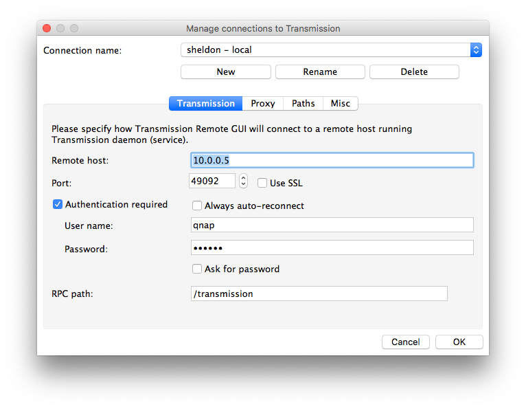
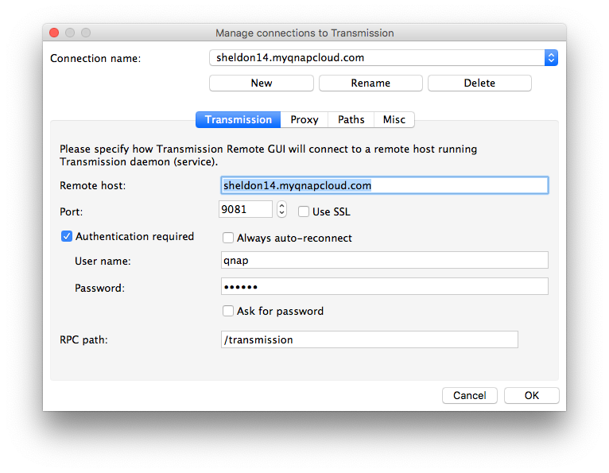
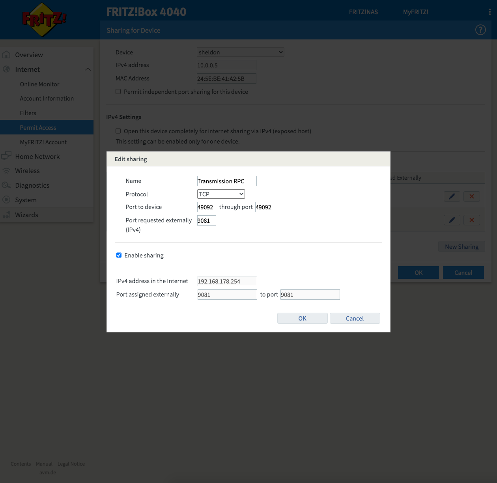

# Transmission
[https://transmissionbt.com/](https://transmissionbt.com/)

## Installazione
Il pacchetto da installare si scarica da qui: [https://www.qnapclub.eu/en/qpkg/208](https://www.qnapclub.eu/en/qpkg/208) (se il link non funziona, fare una ricerca per "transmission" su quello stesso sito web).  
La versione per Sheldon è `TS-NASX86_64`.

Il pacchetto va installato manualmente tramite App Center, e poi va configurato.

## Configurazione

Il file da modificare è questo: `/share/MD0_DATA/.qpkg/QTransmission3/etc/settings.json`  

Bisogna cambiare due cose fondamentalmente: `rpc-username` e `rpc-password`.  
La password va scritta in chiaro tra virgolette e poi al riavvio del server viene crittata con qualche algoritmo, quindi la si ritroverà non leggibile.  
Ho provato anche a modificare la `rpc-port` per fargli usare la stessa che usavo con Frink, ma in quel modo non funzionava più il link dall'icona che viene messa tra le applicazioni del NAS: il link infatti apre l'interfaccia web per forza sulla porta 49092, non importa quello che c'è scritto nel file di configurazione.

## Interfaccia web

Di base Transmission per QNAP mette a disposizione un client web per gestire i download (ma non la configurazione, come si poteva fare una volta) ma è piuttosto basica.
Si può installare un altro pacchetto, chiamato [Transmission web control](https://www.qnapclub.eu/it/qpkg/984) che è un po' meglio. Si accede poi a [http://10.0.0.5:49092/transmission/web/](http://10.0.0.5:49092/transmission/web/)

## Transmission Remote GUI
[https://github.com/transmission-remote-gui/transgui/releases](https://github.com/transmission-remote-gui/transgui/releases)

### Collegamento dalla LAN

## Accesso dall'esterno
Con Frink ero riuscito a configurare per accedere dall'esterno anche tramite Remote GUI, ma su Sheldon non ci sono riuscito e non valeva la pena sbattersi tanto. L'interfaccia web è comunque raggiungibile, credo sia più che sufficiente per le necessità minime.  
Basta collegarsi a [http://sheldon14.myqnapcloud.com:9081/transmission/web/](http://sheldon14.myqnapcloud.com:9081/transmission/web/) dopo aver impostato correttamente il port forwarding ovviamente.

Qualora si dovesse riuscire a cambiare le cose, queste sono le impostazioni per Remote GUI: 

### Port forwarding

